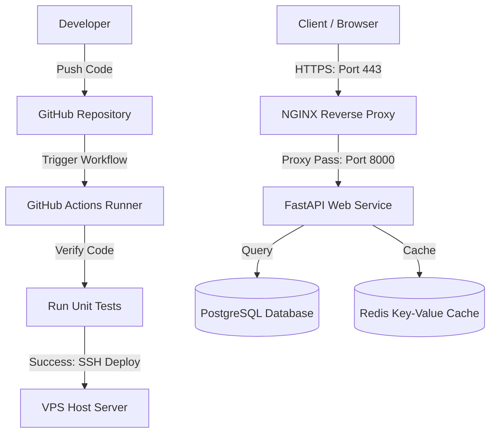

# FastAPI Production Deployment Project

> [!NOTE]  
> **Deployment Status Notice**  
> This project is currently not deployed on an active VPS. Consequently, the GitHub Actions deployment workflow stage (deploy) will show as failed until valid SSH secrets (VPS_HOST, VPS_SSH_KEY, etc.) are configured in the repository's Settings. The pipeline's automated tests (test) execute and complete successfully in the runner environment.

This repository demonstrates a complete, production-grade backend deployment using FastAPI, Docker, Nginx, PostgreSQL, Redis, and a GitHub Actions CI/CD pipeline.

---

## System Topology & Flow

Below is the layout of the deployed services on the Virtual Private Server (VPS) and the GitHub Actions automation flow:

---

## System Flow Overview

To understand how this system operates, it is divided into two primary flows: the **Runtime Request Flow** (how users access the application) and the **CI/CD Deployment Flow** (how code changes reach the server).

### 1. Runtime Request Flow (Traffic Path)
When a user or external service interacts with the application, traffic flows sequentially through the following layers:
* **Client to Proxy:** The user sends a request (e.g., HTTPS on port 443) which is intercepted by the Nginx reverse proxy. Nginx terminates the SSL, maps client headers, and forwards the connection.
* **Proxy to FastAPI:** Nginx forwards the request internally to the FastAPI backend service running on port 8000 inside the private Docker network.
* **FastAPI to Databases:** The application processes the request, querying the PostgreSQL database for persistent data or the Redis cache for transient storage/speed optimizations.

### 2. CI/CD Deployment Flow (Delivery Path)
When changes are made to the codebase, updates are automated through the following pipeline:
* **Developer Push:** Code is pushed to the main branch on GitHub.
* **GitHub Actions Tests:** GitHub triggers a workflow that spins up temporary PostgreSQL and Redis containers to run the test suite.
* **VPS Update:** If tests pass, GitHub Actions establishes an SSH connection to the VPS, pulls the latest code, rebuilds the Docker containers, launches the updated services, and runs a post-deployment health check.

---

## Detailed Documentation Directory

For deep-dive configurations, security guides, and architectural designs, please refer to the specific files inside the **[docs](file:///home/toxsl/FastAPI-Application/docs)** directory:

* **[ARCHITECTURE.md](file:///home/toxsl/FastAPI-Application/docs/ARCHITECTURE.md):** Comprehensive component topology, system interfaces, and detailed end-to-end request lifecycles.
* **[DEPLOYMENT.md](file:///home/toxsl/FastAPI-Application/docs/DEPLOYMENT.md):** Manual server provisioning setup, container builds, service verification commands, and troubleshooting guides.
* **[CICD_PIPELINE.md](file:///home/toxsl/FastAPI-Application/docs/CICD_PIPELINE.md):** Automatic deployment flows, pipeline status checks, and required repository secrets configuration.
* **[SECURITY.md](file:///home/toxsl/FastAPI-Application/docs/SECURITY.md):** Host-level SSH hardening, firewall (UFW) management, container network isolation, and non-root execution permissions.
* **[SSL_SETUP.md](file:///home/toxsl/FastAPI-Application/docs/SSL_SETUP.md):** SSL/TLS encryption setup with or without domain names (Certbot Let's Encrypt, Cloudflare Edge proxy, and Self-Signed configurations).
* **[BACKUP_STRATEGY.md](file:///home/toxsl/FastAPI-Application/docs/BACKUP_STRATEGY.md):** Automatic database replication schedules using shell scripting + cron, manual database restore actions, and recovery protocols.
* **[FAIL2BAN.md](file:///home/toxsl/FastAPI-Application/docs/FAIL2BAN.md):** Intrusion prevention system configuration to ban malicious IPs targeting SSH or Nginx rate-limits.

---

## Core API Endpoints

Once deployed, the following HTTP endpoints are active:

* **Root Endpoint (`GET /`):** Returns the basic application operational status.
* **Health Endpoint (`GET /health`):** Performs active ping verifications on PostgreSQL and Redis connections and returns a status JSON payload.

---
