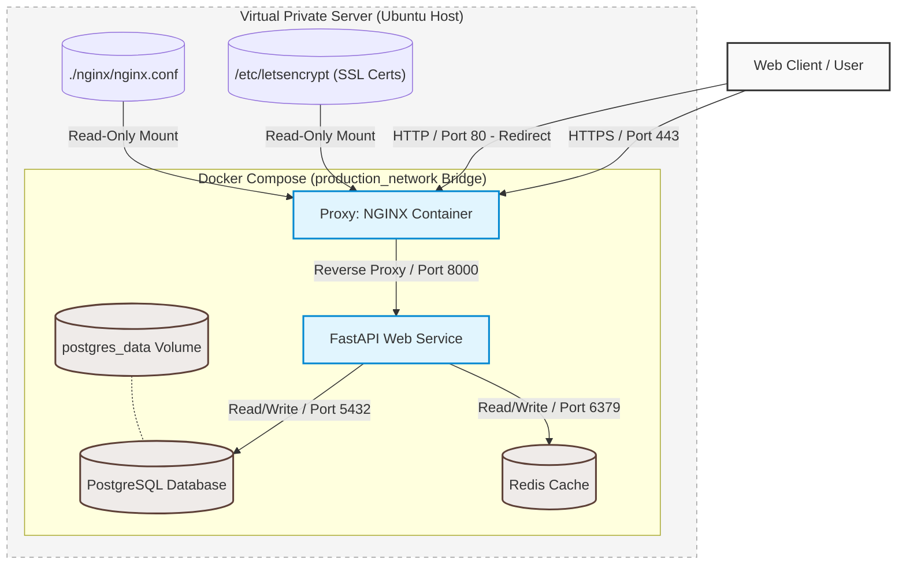

# Production System Architecture

This document provides a detailed overview of the system architecture, component relationships, network isolation boundaries, and the lifecycle of a request from the client to the database.

---

## System Topology

Below is a visual representation of how the deployment environment, networking boundaries, and application layers are structured.

---

## Architectural Components Explained

### 1. Edge Layer: NGINX Reverse Proxy
NGINX acts as the entry point for all incoming traffic to the server. 
* **SSL/TLS Termination:** NGINX listens on port 443 for HTTPS connections, handles the secure cryptographic handshake, terminates the SSL tunnel, and passes clean traffic to the application.
* **HTTP Redirection:** Any traffic coming in on HTTP (port 80) is automatically redirected to HTTPS (port 443) to enforce security.
* **Security Shielding:** By proxying requests, we hide the internal application server (Uvicorn/FastAPI) from direct public exposure, protecting it from raw internet exploits.
* **Static Config & Let's Encrypt:** The container mounts configuration files and SSL certificates directly from the host system in read-only mode (`:ro`), keeping certificates secure.

### 2. Application Layer: FastAPI Web Service
Our core backend is built on FastAPI, chosen for its asynchronous capability, performance, and automatic documentation standard.
* **Process Manager:** Runs inside the container using Uvicorn, an ASGI server designed for high-performance python applications.
* **Service Health Monitoring:** Exposes a custom `/health` endpoint that actively tests downstream connectivity (PostgreSQL and Redis) and reports the system's operational viability.
* **Environment Configuration:** Does not hardcode database URLs or credentials. Instead, it dynamically consumes environment parameters passed through Docker Compose at startup.

### 3. Caching Layer: Redis
To optimize performance, Redis is utilized as an in-memory key-value store.
* **Transient Storage:** Stores session data, rate-limiting counters, or heavy database query caches.
* **Isolation:** Port 6379 is bound exclusively to `127.0.0.1` inside the host and the internal Docker network. External scripts or attackers cannot scan or connect to Redis.

### 4. Database Layer: PostgreSQL
The source of truth for persistent application state.
* **Data Persistence:** Database data is mounted to a named Docker volume (`postgres_data`). This ensures that even if the container is destroyed, updated, or restarted, the data remains safely persisted on the host disk.
* **Port Security:** Similar to Redis, the database port 5432 is bound only to localhost (`127.0.0.1`). Only the backend container inside the Docker bridge network is permitted to communicate with it.

---

## End-to-End Request Lifecycle

Here is the exact journey a request takes when a user interacts with the application:

1. **DNS Resolution & Handshake:**
   * The user requests `https://example.com/health`.
   * The domain resolves to your VPS public IP address.
   * A TCP connection is established on port 443. NGINX performs the TLS handshake using Let's Encrypt certificates.

2. **Reverse Proxy Routing:**
   * NGINX intercepts the request, strips the SSL wrapper, and appends upstream headers (`X-Real-IP`, `X-Forwarded-For`, `X-Forwarded-Proto`) to keep track of the client's original parameters.
   * NGINX forwards the request to the upstream target `http://web:8000/health` inside the Docker network.

3. **Application Processing:**
   * FastAPI catches the request on `/health`.
   * The application initiates a connection verification block:
     * Ping PostgreSQL over `postgresql://...` to verify read/write status.
     * Ping Redis to ensure caching is operational.
   * If both respond, it returns a 200 OK JSON response.

4. **Response Delivery:**
   * FastAPI sends the JSON response back to NGINX.
   * NGINX packages the response into an encrypted HTTPS envelope and returns it to the client's browser.