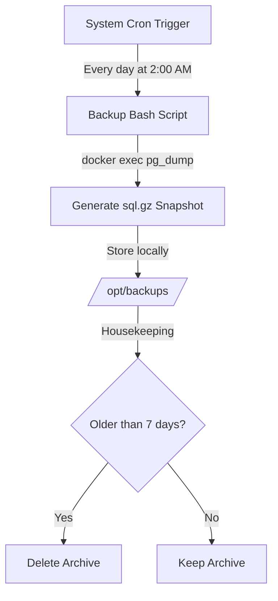

# Production Backup and Recovery Strategy

In any production environment, data integrity is of paramount importance. This document details our automated backup policy, manual snapshot capabilities, and the disaster recovery protocol for the PostgreSQL database container.

---

## Backup Architecture and Schedule



---

## 1. Manual Backup and Restore (On-Demand)

Manual snapshots are typically executed before run-time deployments, server maintenance, or system migrations.

### Creating an Immediate Backup:
Run this command from your VPS host terminal:
```bash
# Export the database snapshot as a compressed SQL archive
docker exec -t fastapi-application-db-1 pg_dump -U postgres production_db | gzip > /opt/backups/manual_backup_$(date +%F).sql.gz
```

### Restoring an On-Demand Backup:
To restore database states from a backup file:
```bash
# Decompress and feed the archive back into the running container
gunzip -c /opt/backups/manual_backup_xxxx-xx-xx.sql.gz | docker exec -i fastapi-application-db-1 psql -U postgres production_db
```

---

## 2. Automated Daily Backups

We utilize a simple, robust shell script integrated with the host's `cron` daemon to run automated nightly backups.

### Step 1: Create the Backup Execution Script
Create a backup execution script on the host system:
```bash
sudo nano /opt/backup.sh
```

Paste the following bash contents:
```bash
#!/bin/bash
set -e

# Configuration
DATE=$(date +%Y-%m-%d_%H-%M-%S)
BACKUP_DIR="/opt/backups"
DB_CONTAINER="fastapi-application-db-1"
DB_USER="postgres"
DB_NAME="production_db"

# Ensure the backup directory exists
mkdir -p "$BACKUP_DIR"

# Perform backup and compress on the fly
echo "[$(date)] Initiating database backup..."
docker exec -t "$DB_CONTAINER" pg_dump -U "$DB_USER" "$DB_NAME" | gzip > "$BACKUP_DIR/db_backup_$DATE.sql.gz"
echo "[$(date)] Backup completed: db_backup_$DATE.sql.gz"

# Retain backups for only 7 days to conserve disk space
find "$BACKUP_DIR" -type f -name "db_backup_*.sql.gz" -mtime +7 -delete
echo "[$(date)] Housekeeping done: deleted backups older than 7 days."
```

### Step 2: Grant Execution Permissions
Restrict file permissions so only system administrative accounts can run or read the backup:
```bash
sudo chmod +x /opt/backup.sh
sudo chmod 700 /opt/backups
```

### Step 3: Register the Cron Schedule
Open the system crontab:
```bash
sudo crontab -e
```
Add the following line to schedule the backup to execute every night at **2:00 AM**:
```text
0 2 * * * /opt/backup.sh >> /var/log/db_backup.log 2>&1
```

---

## 3. Disaster Recovery Plan

If the server crashes, database corruption occurs, or data is accidentally modified, follow this recovery roadmap:

1. **Reinitialize the Docker Infrastructure:**
   Ensure the containers are cleanly built and running:
   ```bash
   docker compose down
   docker compose up -d --build
   ```

2. **Verify Container Connectivity:**
   Ensure the database container has finished starting and is ready to accept commands:
   ```bash
   docker compose ps db
   ```

3. **Deploy the Database Restore:**
   Locate your most recent healthy backup snapshot in `/opt/backups/` and restore it:
   ```bash
   gunzip -c /opt/backups/db_backup_YYYY-MM-DD_HH-MM-SS.sql.gz | docker exec -i fastapi-application-db-1 psql -U postgres production_db
   ```

4. **Verify Health Validation Check:**
   Verify that database entities are restored and the endpoint returns a healthy status code:
   ```bash
   curl -i http://localhost/health
   ```