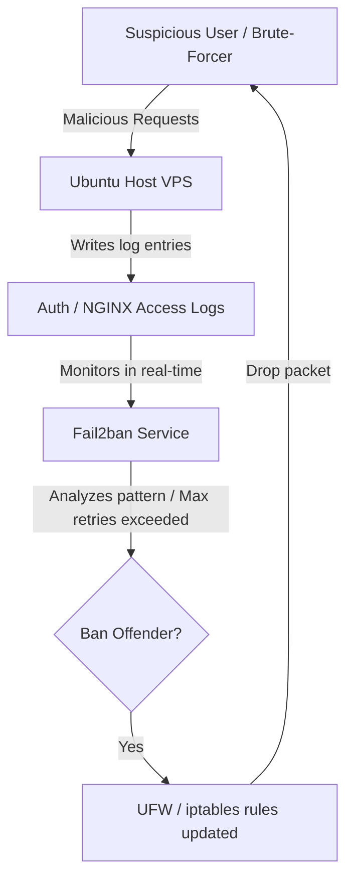

# Fail2ban Intrusion Prevention Configuration

Fail2ban is an intrusion prevention framework that protects computer servers from brute-force attacks. It works by monitoring system logs (like SSH and NGINX logs) for suspicious activity and dynamically updates host firewall rules (UFW/iptables) to ban offending IP addresses.

---

## Fail2ban Operations Flow



---

## Step-by-Step Installation on Host VPS

Run these commands directly on the host operating system:

```bash
# 1. Update package registry and install fail2ban
sudo apt update
sudo apt install fail2ban -y

# 2. Verify that the fail2ban service is active and running
sudo systemctl status fail2ban
```

---

## Configuration Setup

Fail2ban reads configurations from `.conf` files, but modifications should always be made inside local override files (`.local`) to prevent package updates from overwriting them.

### Step 1: Create the Main Config File
Create the custom local configuration:
```bash
sudo nano /etc/fail2ban/jail.local
```

Paste the following configurations to protect **SSH** and block bad actors:
```ini
[DEFAULT]
# Ban hosts for 1 hour (3600 seconds)
bantime  = 3600

# Look for login failures over a window of 10 minutes
findtime = 600

# Ban an IP after 5 failed authentication attempts
maxretry = 5

# Override banning actions to work directly with UFW
banaction = ufw

[sshd]
enabled  = true
port     = ssh
logpath  = %(sshd_log)s
backend  = %(sshd_backend)s
```

---

## NGINX Rate Limiting Integration

To protect your API from Denial of Service (DoS) and scraping attempts, you can monitor NGINX logs.

### Step 1: Enable NGINX Jail in `/etc/fail2ban/jail.local`
Append the NGINX monitoring jail to your config file:
```ini
[nginx-http-auth]
enabled  = true
filter   = nginx-http-auth
port     = http,https
logpath  = /var/log/nginx/error.log

[nginx-limit-req]
enabled  = true
filter   = nginx-limit-req
port     = http,https
logpath  = /var/log/nginx/error.log
```

*Note: Make sure your NGINX container is logging to the host's `/var/log/nginx` directory or standard syslog targets.*

---

## Service Management & Commands

Once configurations are in place, restart the service:

```bash
# Apply configuration modifications
sudo systemctl restart fail2ban

# Check the status of active jails
sudo fail2ban-client status

# Check detailed status of the SSH jail
sudo fail2ban-client status sshd
```

### Unbanning an IP Address:
If a developer accidentally gets banned, run the following command to restore access:
```bash
sudo fail2ban-client set sshd unbanip <ATTACKER_IP_ADDRESS>
```

