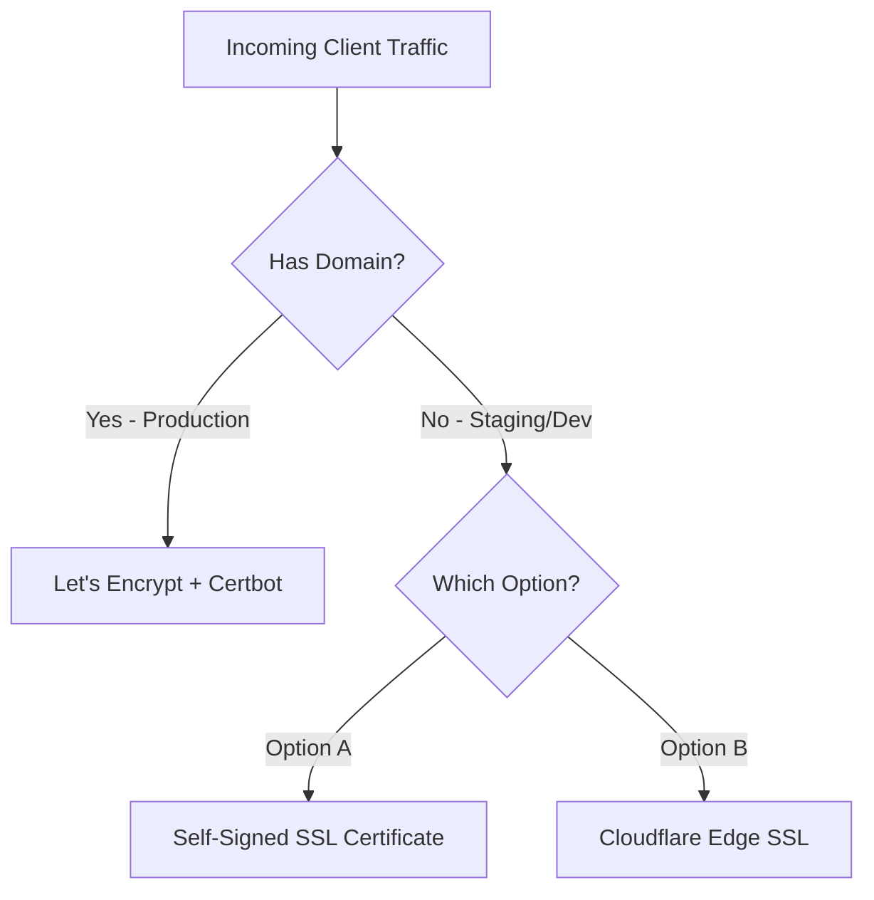

# 🔐 SSL/TLS Configuration Strategy

Securing server communications via SSL/TLS is critical for protecting customer data and avoiding security warnings in browsers. This document outlines the SSL setup strategy for both domain-ready production systems and environments without domain names.

---

## 🌍 Strategy Overview



---

## ❌ Scenario A: No Domain Name Available

If you are deploying for testing or evaluation purposes and do not have a public domain name registered, use one of the following methods:

### 🟡 Option 1: Self-Signed SSL Certificates (Testing Only)
You can generate your own cryptographic keypair directly on the server. However, modern browsers will display a **"Your connection is not private" warning** because the certificate is not signed by a trusted Certificate Authority (CA).

#### 1. Generate the Key and Certificate:
Run the following openssl command on your VPS:
```bash
openssl req -x509 -nodes -days 365 -newkey rsa:2048 \
  -keyout ./nginx/selfsigned.key \
  -out ./nginx/selfsigned.crt \
  -subj "/C=US/ST=State/L=City/O=Organization/OU=DevOps/CN=your_vps_ip"
```

#### 2. Configure NGINX for Self-Signed SSL:
Modify your `nginx.conf` server block:
```nginx
server {
    listen 443 ssl;
    server_name _;

    ssl_certificate     /etc/nginx/selfsigned.crt;
    ssl_certificate_key /etc/nginx/selfsigned.key;

    location / {
        proxy_pass http://web:8000;
    }
}
```

---

### 🟡 Option 2: Cloudflare Edge SSL (Recommended Option)
If you own a domain name but cannot point it directly to the host yet, or want Cloudflare to handle SSL automatically, you can use Cloudflare's free DNS proxy.

1. **Register** your domain name with Cloudflare.
2. **Point** your domain's `A Record` to your VPS public IP address in the Cloudflare DNS dashboard.
3. **Enable Proxying** (toggle the Cloudflare cloud icon to orange/active).
4. Set Cloudflare SSL Mode to **Flexible** or **Full**:
   * **Flexible:** Traffic between user and Cloudflare is encrypted (HTTPS). Traffic between Cloudflare and your VPS is unencrypted (HTTP on port 80).
   * **Full:** Traffic is encrypted end-to-end, allowing you to use a self-signed certificate on the VPS.

---

## 🌐 Scenario B: Domain Name Available (Standard Production Method)

This is the standard approach for production-grade environments. We use **Let's Encrypt** to issue a free, globally-trusted SSL certificate.

### Step 1: Ensure DNS Propagation
Create an `A Record` pointing your domain and subdomains to the public IP address of your VPS:
* `yourdomain.com` ➔ `YOUR_VPS_IP`
* `www.yourdomain.com` ➔ `YOUR_VPS_IP`

Verify propagation using `dig` or `nslookup`:
```bash
nslookup yourdomain.com
```

### Step 2: Install Certbot on the Host VPS
Certbot is an automated client that communicates with the Let's Encrypt CA to request and auto-renew certificates. Run these commands on your host system:
```bash
sudo apt update
sudo apt install snapd -y
sudo snap install core; sudo snap refresh core
sudo snap install --classic certbot
sudo ln -s /snap/bin/certbot /usr/bin/certbot
```

### Step 3: Run Certbot to Fetch Certificates
Certbot will spin up a temporary standalone web server to verify your domain ownership and download the certificate files:
```bash
# Make sure NGINX is temporarily stopped to free up port 80
docker compose down

# Request the SSL certificate
sudo certbot certonly --standalone -d yourdomain.com -d www.yourdomain.com
```

Your certificate keys will be safely stored under:
`/etc/letsencrypt/live/yourdomain.com/`

---

## 🐳 Docker Compose Mounting Strategy

To allow NGINX running inside a container to read certificates generated on the host system, we mount the Let's Encrypt directory as a read-only volume.

### 1. In `docker-compose.yml`:
```yaml
services:
  nginx:
    image: nginx:alpine
    ports:
      - "80:80"
      - "443:443"
    volumes:
      - ./nginx/nginx.conf:/etc/nginx/nginx.conf:ro
      - /etc/letsencrypt:/etc/letsencrypt:ro  # Read-only mount from host
```

### 2. In `nginx/nginx.conf`:
Uncomment the HTTPS block and update the paths:
```nginx
server {
    listen 443 ssl;
    server_name yourdomain.com www.yourdomain.com;

    # SSL Cert Files (Mounted from host /etc/letsencrypt)
    ssl_certificate     /etc/letsencrypt/live/yourdomain.com/fullchain.pem;
    ssl_certificate_key /etc/letsencrypt/live/yourdomain.com/privkey.pem;

    # Modern TLS Security settings
    ssl_protocols TLSv1.2 TLSv1.3;
    ssl_prefer_server_ciphers on;

    location / {
        proxy_pass http://web:8000;
    }
}
```

### Step 4: Configure Automatic Certificate Renewal
Let's Encrypt certificates are valid for 90 days. Set up a system cron job to check for renewals daily:
```bash
# Open the system crontab editor
sudo crontab -e
```
Add the following line to run a renewal check every day at 3:00 AM:
```text
0 3 * * * certbot renew --post-hook "docker compose -f /opt/fastapi-app/docker-compose.yml exec -T nginx nginx -s reload"
```
*(This automatically reloads NGINX configs without downtime once a certificate is renewed).*